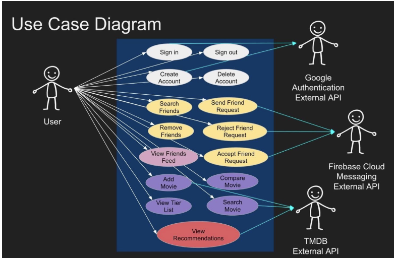
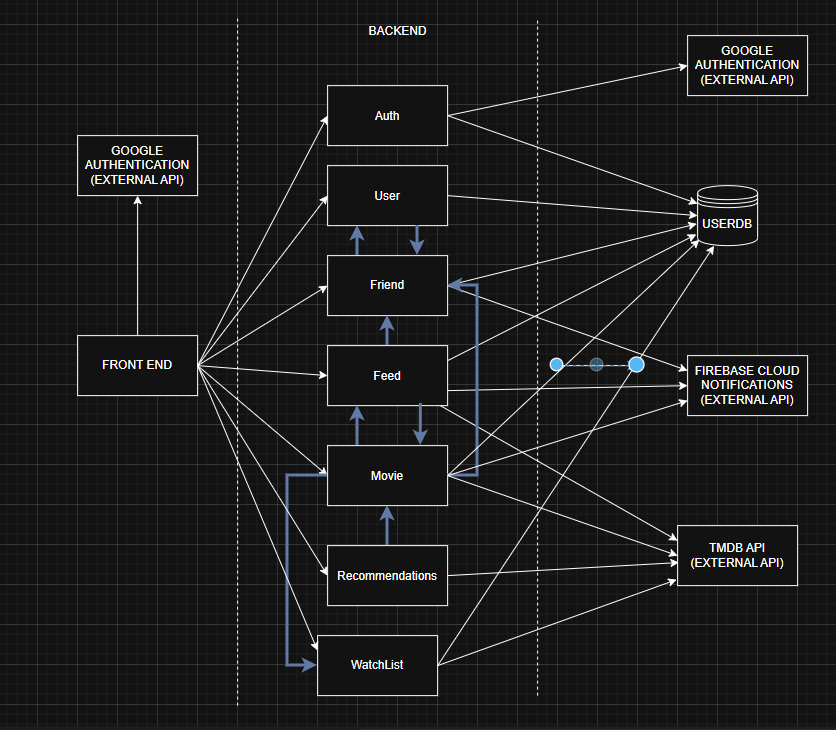

# Requirements and Design

## 1. Change History

| **Change Date**   | **Modified Sections** | **Rationale** |
| ----------------- | --------------------- | ------------- |
| _Nothing to show_ |

---

## 2. Project Description

MovieTier is a social movie companion app that makes discovering, ranking, and sharing films fun and interactive. On this app, users can login and see what movie their friends have currently rated, themselves can rate a new movie, and get a list of recommended movies based on the movies they have recommended.
In this app instead of giving out boring stars to rate a movie, the user decides which movie they liked more in a head-to-head matchup (comparing the new movie to a movie they have previously ranked), and then the app calculates the rank of the movie automatically . Over time, their personal tier list is built automatically, reflecting their true taste in cinema.

---

## 3. Requirements Specification

### **3.1. List of Features**

1. Authentication - There will be a google login/auth page that will allow users to sign up or sign into their account. A user can also delete their account.
2. Manage Friends - The user will be allowed to send a friend request as well as accept/reject friend requests. Under the “Manage Friends” feature, the user will be able to see the list of already added friends and can even remove a friend. 
3. Feed - A user gets real time updates of their friends activities on their feed. Users get live notification whenever a friend ranks a new movie. Feed contains all friend activities (sorted in reverse chronological order) which include the movie name, ranking, friend name, and movie banner of the friends ranking. 
4. Ranked Movie List - Users will be able to generate a ranked list of movies they have seen. They can search for movies, add movies, and then rank the movie, based on comparison between previously ranked movies.  The app will then assign a final ranking to the movie based on the comparison done by the user.

5. Recommendation - Based on users top movies rankings there will be a recommended list of movies that the user can watch. The recommendation list will be generated based on the top movies on the users tiered list. The list will exclude all the movies which are already ranked by the user. Each movie in the list will contain the movie name, movie banner, and movie duration. 

### **3.2. Use Case Diagram**

### **3.3. Actors Description**

1. User - The User will be the main actor of our app. They will create an account, login, add friends, rank movies and view recommendation lists. 
2. Google Auth API - This will be the external actor which will handle all the sign ins and sign ups. 
3. TMDB API - The TMDB API will provide the movie details and recommendations for movies. This is also an external actor. 

### **3.4. Use Case Description**

- Use cases for feature 1: Authentication 

1. Sign In : When a user has already created their account, they can just sign in with their google account.
2. Sign Up: All new users will use the Sign Up use case to create an account. 
3. Delete Account: When  a user wants to delete an account. 
4. Sign Out: When a user wants to sign out of the app, they can use the sign out use case.

- Use cases for feature 2: Manage Friend
 
1. Send Friend Request: Users will use this use case to send friend requests to a friend. 
2. Accept Friend Request: To accept friend requests received by the user.
3. Reject Friend Request : To reject a friend request received by the user. 
4. Remove Friend: To remove a friend who is a friend of the user. 

- Use cases for feature 3: Feed

1. View Feed: The user can view all their friends' activities in their feed. 
2. View Live Update Notification: Every time a friend ranks a movie, a push notification will be received by the user. 

- Use cases for feature 4: Ranked Movie List

1. Search a Movie: Users can search names of a movie by using the Search Movie use case.
2. Add a Movie: Users can add a movie to their ranked lists. 
3. Compare Movies: To rank a movie users must compare the movie with some other movies they have already ranked for the system to generate an accurate ranking of the movie.
4. View Ranking List: The users can view their ranked movie list. 

- Use cases for feature 5: Recommendation

1. View Recommended Movie List: The user can view a list of recommended movies that the application suggests based on their previously ranked movies. 

### **3.5. Formal Use Case Specifications (5 Most Major Use Cases)**

#### Use Case 1: SIGN IN

**Description**: User logs in to their account through Google Authentication API.

**Primary actor(s)**: User, Google Authentication API

**Postcondition(s)**: 

User is logged in and redirected to the home feed
**Main success scenario**: 

1. User clicks “Sign In”
2. System redirects to Google Authentication page
3. User enters credentials and clicks submits
4. Google validates credentials and returns auth token
5. System checks its database for user account
5. System verifies token, signs the user in, and takes them to the home feed

**Failure scenario(s)**:

- 3a. User enters invalid credentials 
  - 3a1. Google rejects login attempt
  - 3a2. App displays error message and asks the user to retry

- 5a. User account does not exists in database
  - 5a1. System displays error message: “User Does Not Exist Please Sign Up”
  - 5a2. User can use the Sign Up use case

#### Use Case 2: SEND FRIEND REQUEST

**Description**: User sends a friend request to a friend by entering their email address.

**Primary actor(s)**: User

**Precondition(s)**: 

1. User is logged into the system
2. User is on the “Manage Friends” Page

**Main success scenario**:

1. User enters the friends username/email address
2. System searches and displays matching profile
3. User clicks send friend request button 
4. System displays a success message: “Friend Request Successfully Sent”
5. System notifies Friend to accept/deny pending request

**Failure scenario(s)**:

- 1a. No user with the given email/username exists
  - 1a1. System notifies the user: “No user Found”
  - 1a2. User retires this use cases with a different input

- 3a. Friend is already added
  -3a1. System Notifies the user: “Error: Friend already exists”

- 3b. Friend request already pending
  - 3b1. The system notifies the user: “Error: Request was already sent.”

#### Use Case 3: VIEW FEED

**Description**:  User views the recent activities of their friends on their feed. 

**Primary actor(s)**: User

**Precondition(s)**:

User is logged in
The user is on the “Feed” page

**Main success scenario**:

1. System retrieves latest friend activity (new movies ranked by friends)
2. System displays the friend activities in a reverse chronological order 
**Failure scenario(s)**:

- 1a.User has no friends yet
  - 1a1. The system displays “No Friends yet. Add friends to see activity”
  -1a2. The system displays a link to the “Manage Friends” page

- 1b. User’s friends have not ranked any movies
  - 1b1. The system displays “No Friend Activity Yet”

#### Use Case 4: COMPARE MOVIES

**Description**: The system generates movie pairs for the user to compare until the system calculates the ranking of the movie being added. The movie pair consists of the movie being ranked and a movie which the user has already ranked previously. The user selects the movie they prefer from the two movies displayed.  

**Primary actor(s)**: User

**Precondition(s)**: 

1. User is logged in 
2. User has searched for a movie and clicked on “Add Movie”

**Main success scenario**:

1. System selects a movie that the user has previously ranked
2. System asks the user to compare the selected movie and the movie that is being ranked
3. User selects a movie
4. System generates a ranking of the movie
5. Movie gets added to the ranked list of user’s movies
6. User gets notified: “Movie successfully ranked”

**Failure scenario(s)**:

- 1a. User has ranked no movie previously
  - 1a1. Systems adds the movie as it is to the list 

- 3a. User exists the app without comparing
  - 3a1. System exists comparison
  - 3a2. The movie is not added to the list of User’s Movie

- 4a. The systems needs to compare the movie with more previously ranked movies to generate a ranking
  - 4a1. The system keeps on repeating this use case again until a ranking is generated

#### Use Case 5: VIEW RECOMMONDED MOVIE LIST

**Description**: System generates a recommended movie list based on the top movies on the user’s ranked movie list. 

**Primary actor(s)**: User, TMDB API

**Precondition(s)**:

1. User is logged in
2. User clicks the Recommendation tab and is directed to the Recommended movies page

**Main success scenario**:

1. System extracts the top 5-10 movies from the user’s ranked movie list
2. System requests TMDB api to fetch related movies to the selected movies
3. TMDB api sends a list of related movies
4. System filters the list by removing movies which are already in the user’s list
5. System displays the recommended movie list with movie title, and movie banner for each movie

**Failure scenario(s)**:

- 1a. User has no movies ranked
  - 1a1. System displays a message:”No movies in your movie list, to get a personalized list please rank movies”
  - 1a2. System extracts a list of all time favorite movies from TMDB and display those movies

- 4a. User has watched all movies in the recommended list
  -4a1. The system displays a message: “All caught up! You have seen all the movies in your recommended list.”
  -4a2. The system extracts and displays a list of all time favorite movies from TMDB api

### **3.6. Screen Mock-ups**(optional)

### **3.7. Non-Functional Requirements**

1. **[Ranking Performance]**
   - **Description**: Comparative ranking interactions (selecting between two movies) should update the user’s tier list in under 1 second.
   - **Justification**: The comparative ranking feature is the core interaction of MovieTier. If it feels sluggish, the entire app experience suffers. Keeping the update time under 1 second ensures the interaction feels immediate and engaging, which is critical for usability and user retention. We derived this number from this [study](https://www.uptrends.com/blog/the-psychology-of-web-performance).
2. **[Recommendation List]**
   - **Description**: Any core task (signing in, rating a movie, viewing the feed) should be achievable within 3 clicks/taps.
   - **Justification**: The fewer steps users have to make, the smoother and more intuitive their experience feels. According to [Impact of number of clicks on user experience](https://medium.com/@gizemkorpinar/impact-of-click-number-on-user-experience-fab78e1f2a91) (Gizem Korpinar), fewer clicks tend to correlate with higher perceived usability: “the fewer clicks required to achieve a user’s goal, the greater the usability.”  Users often abandon journeys when they perceive they’re clicking too much. While the “3-click rule” isn’t a hard law and some debate its strict applicability, it works well as a guideline for core tasks.
---

## 4. Designs Specification

### **4.1. Main Components**

1. **UserManager**
   - **Purpose**: Handles user sign-up, sign-in (via Google Auth), account creation, and profile management. Ensures each Google account maps to a MovieTier user record in the database.

2. **FriendManager**
   -**Purpose**: Manages friendships (sending/accepting/rejecting friend requests, removing friends) and generates the activity feed with real-time updates when friends rate or compare movies.

3.**MovieListsManager**
   -**Purpose**:  Provides the logic for comparative ranking of movies, stores user rankings, updates tier lists based on comparisons and also computes the user recommendation movie list.

4. **UserFeed**
   -**Purpose**: User feed handles the situation when a user adds a movie to their lists and notifies the users friends on their feed.

### **4.2. Databases**

1. **UserDB**
   - **Purpose**: This is the sole database for our application. We will have separate tables in this database to store user login credentials, ranked movie lists, friends, requests, recommendations, and friend activities. 

### **4.3. External Modules**

1. **Google Auth API**
   - **Purpose**: Authorize sign in and sign ups of users into the application 
2. **TMDB API**
   -**Purpose**: Fetch related movies to generate recommended movie lists, respond to the search movies and movie related information
3. **Firebase Cloud Notifications** 
   -**Purpose**: Send real time push notifications to the user when a friend ranks a movie.

### **4.5. Dependencies Diagram**

