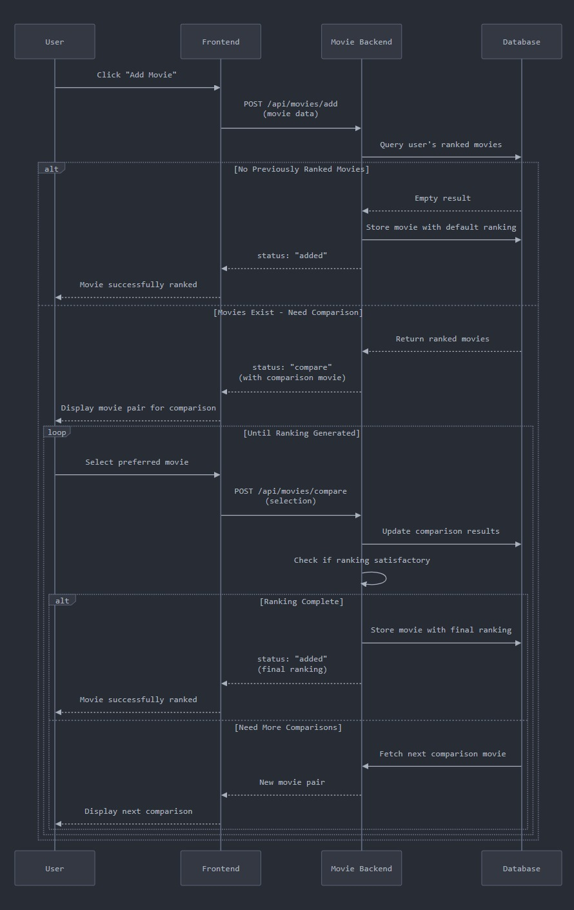
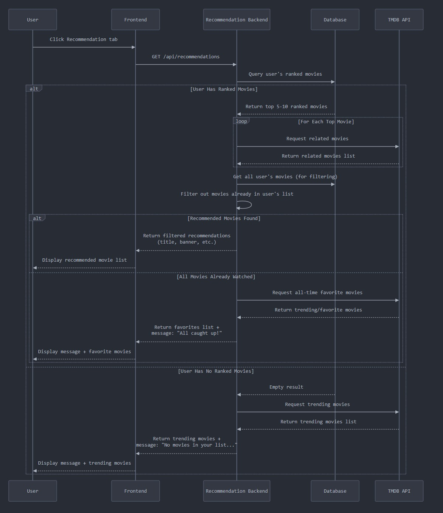

# Requirements and Design

## 1. Change History
 
| **Change Date** | **Modified Sections** | **Rationale** |
| --------------- | --------------------- | ------------- |
| 2025-10-26      | 3.1 (Feed & Discover), 3.4 (Feed use case), 4.3, 4.4 | **Feed Toggle Redesign & Quote System Clarification**: (1) Feed screen now uses compact floating pill toggles for "Friends" vs "My Activities", centered above the list so content flows beneath. Added documentation for new FAB-style segmented controls and adjusted feed padding to avoid overlap. (2) Clarified Discover featured quote sourcing: The app attempts to fetch quotes from the TMDB tagline service via `/api/quotes` (which now returns TMDB taglines rather than Wikiquote data) and caches successful responses. When the API has no tagline or the request fails, the app falls back to a local offline catalog of ~1,050 curated movie-themed taglines with deterministic daily rotation. Updated documentation to accurately reflect the hybrid approach. |
| 2025-10-25      | 3.1 (Feed), 3.4 (Feed use cases), 4.1 (UserFeed interfaces), 4.2 (Database), Design notes | **Feed Interaction Features - Likes and Comments**: Added social engagement features to feed activities. (1) Backend: Created Like and Comment models with MongoDB schemas, compound indexes for performance (userId+activityId unique for likes, activityId+createdAt for comments). Added endpoints: POST/DELETE /api/feed/:activityId/like for liking/unliking, GET/POST /api/feed/:activityId/comments for viewing/adding comments (500 char limit). Updated GET /api/feed to include likeCount, commentCount, and isLikedByUser fields. (2) Frontend: Updated FeedActivity model with new fields, added like/unlike toggle with optimistic UI updates, created CommentBottomSheet component for viewing and posting comments. Feed cards now display thumbs up icon (filled when liked) and comment bubble icon with counts. Comment sheet shows all comments with user avatars, timestamps, and inline comment input field. (3) UI: Like button shows primary color when liked, comment count updates in real-time after posting. |
| 2025-10-25      | 3.1 (UI consistency), Design notes | **Star Rating Display Standardization**: Replaced text-based ratings ("★ 8.4") with consistent 5-star visual display across entire app using StarRating component. (1) Display format: Year + 5 stars with partial fill + rating number (e.g., "2023 ⭐⭐⭐⭐⭐ 8.4"). TMDB 0-10 scale converted to 0-5 stars, gold filled stars (#FFD700), 14dp star size, 8dp spacing. (2) Updated screens: Profile watchlist preview, Friends profile watchlist, Feed activity cards, Feed movie detail bottom sheet, Watchlist screen, all movie detail sheets. (3) Fixed FriendProfileScreen top banner overflow: added maxLines=1 and ellipsis to prevent wide banner with long friend names. Consistent format now matches Discover, Ranking, and Recommendation screens. |
| 2025-10-25      | 3.1 (Discover), 4.3 (External modules), 4.4 (Backend frameworks), UI consistency | **Featured Movie Quote Card & UI Consistency Improvements**: (1) Fixed quote card bug on Discover page: removed plot description fallback that was incorrectly showing movie summaries as "quotes". Expanded curated quote database from ~120 to 575+ movies (5x increase) covering all major genres, franchises, and eras. Increased Wikiquote API timeout from 3.5s to 6s for better real quote fetching. Added smart movie-themed fallback messages. (2) Standardized "add to ranking" behavior across all screens (Ranking, Feed, Discover/Recommendation, Friends, Watchlist): bottom sheets now close on success/error, feedback messages display at top of screen overlaying current page, auto-dismiss after 4 seconds. Added RankingEvent.Error type for proper error handling. (3) Backend: Added cheerio library for Wikiquote HTML scraping, fixed TypeScript compilation errors. |
| 2025-10-24      | 4.1 (UserManager), 4.3 (External modules), 4.4 (Backend/Frontend frameworks) | **Firebase Cloud Messaging Implementation**: Implemented push notifications for real-time user engagement. (1) Backend: Added FCM token registration endpoint (POST /api/users/fcm-token), integrated firebase-admin SDK for sending notifications, extended User model with fcmToken field, integrated notifications into feed activity creation and friend request flows. (2) Frontend: Added Firebase Cloud Messaging SDK (BOM 33.7.0), implemented MovieTierFirebaseMessagingService for receiving notifications, created two notification channels (feed_updates and friend_requests), automatic token registration on app startup and refresh, notification permission handling for Android 13+. (3) Notifications sent for: friend ranks new movie, incoming friend request, friend request accepted. Documentation includes setup guide in documentation/FCM_SETUP.md. |
| 2025-10-24      | 3.4, 3.5, 4.1, 4.4, 4.6, 4.7 | **M3 Milestone Completion**: (1) Section 3.4: Added watchlist use cases (7 cases: add, view, remove, sort, ranking integration, watch providers, friend watchlist). (2) Section 3.5: Replaced authentication with "Use Case 6: ADD MOVIE TO WATCHLIST" (9-step scenario, 4 failure cases). (3) Section 4.1: Component interfaces with HTTP/REST endpoints (UserManager, FriendManager, MovieListsManager, UserFeed, WatchlistManager) and internal service interfaces. (4) Section 4.4: Frameworks/libraries documentation (Backend: Express.js, Mongoose, google-auth-library, jsonwebtoken, axios, TypeScript, Jest; Frontend: Jetpack Compose, Hilt, Retrofit, Coil, Kotlin Coroutines) with versions. (5) Section 4.6: Sequence diagram structure for 5 major use cases. (6) Section 4.7: NFR implementation (ranking performance, usability constraints). |
| 2025-10-24      | 3.1 (Discover), 3.4 (Recommendation use case), 4.3 (External modules), Design notes | Added in-app trailer playback: Movie detail sheets on Discover page now include a play button overlay on the poster when a trailer is available. Clicking the play button opens the trailer in a 9:16 popup window using WebView to load the full YouTube mobile page. The popup includes a close button and supports fullscreen toggling. Backend endpoint `/api/movies/:movieId/videos` fetches trailer information from TMDB API. Provides seamless in-app viewing without leaving the app. |
| 2025-10-24      | 3.1 (Discover), 3.4 (Recommendation use case) | Added "Add to Ranking" functionality from Discover page: Users can now add movies to their rankings directly from the Discover page movie detail sheet. Clicking the "Add to Ranking" button triggers the interactive comparison flow on the same page (same UX as the ranking screen). No navigation required - the entire ranking process happens inline on the Discover page. |
| 2025-10-24      | 3.1 (Ranking UI), Design notes | Redesigned ranking list actions UI: Tap any ranking card to open a Material Design 3 modal bottom sheet with action options. Sheet displays movie title and two actions: "Rerank" (with description "Compare and adjust position") and "Delete from Rankings" (with error color styling). Delete action requires confirmation dialog. Clean, intuitive, and follows Android design patterns. |
| 2025-10-24      | 3.1 (Discover/Recommendation), 3.4 (Recommendation use case), Navigation order | Added trending movies feature: When users have no ranked movies, the Discover page now displays trending movies from TMDB instead of an empty state. Backend endpoint `/api/recommendations/trending` fetches weekly trending movies. Navigation order changed to: Discover, Ranking, Feed, Friends, Profile (Discover is now the first tab and default landing page after authentication). |
| 2025-10-23      | 3.1 (Profile editing), 3.4 (Edit profile use case), 4.3 (External modules) | Added profile editing feature and corrected documentation: Users can edit display name via PUT /api/users/profile. Profile pictures are automatically sourced from Google account during sign-up and stored in profileImageUrl field (not uploaded separately). Profile data persists locally in DataStore. Removed incorrect MinIO references from External Modules section. |
| 2025-10-23      | 3.1 (Recommendation refresh), 3.4 (Recommendation use case) | Added personalized recommendation algorithm to Discover page. Algorithm analyzes user preferences from ranked movies (genres, languages, quality threshold), fetches similar/recommended movies from TMDB for top 30% of ranked movies, scores candidates based on genre matching, language preference, vote average, and recency, then adds random noise (±5) to scores to provide variety across refreshes. Returns top 20 recommendations. |
| 2025-10-23      | 3.1 (Watchlist synchronization) | Added automatic watchlist-ranking synchronization: movies are now removed from watchlist when added to rankings, ensuring watchlist only contains unwatched movies. |
| 2025-10-22      | 3.1, 3.4, Design notes | Ranking UX: search shows posters and top actors; ranking list shows poster, year, star rating, actors, and overview; year+rating on one line; rank chip above poster. Backend adds movie details and delete‑rank endpoints. |
| 2025-10-22      | 3.1 (Watchlist) | Watchlist improvements: added sorting (date added asc/desc, rating asc/desc) and display of year + star rating on each item. |
| 2025-10-20      | 3.1, 3.4, Design notes | Added "Where to Watch" feature with refinements: Feed detail bottom sheet, Watchlist items, and Friend Profile watchlist fetch TMDB watch providers (country from device locale with CA fallback) and open the TMDB watch link. Feed preview shows inline availability (top 4 platforms with " …" if more). Availability text uses grey on-surface-variant tone. Added on-device caching (DataStore, 6h TTL) for provider results to reduce API calls. |
| 2025-10-15      | 3.1 (Feed notes + Watchlist), 3.4 (Feed detail + Watchlist), Design notes | Documented Feed enhancements (TMDB description, PST yyyy-MM-dd HH:mm timestamps, card layout), Ranking add via TMDB search, added Watchlist feature (add from feed detail, Profile preview + View All, friend watchlist view), and UI feedback notes. |
| 2025-10-14      | 3.1, 3.4 (Manage Friend), Design notes | Implemented and finalized Friends feature: send/accept/reject/cancel requests, remove friend, search by name/email, outgoing requests visible (top) and cancellable, real-time SSE with reconnection/backoff, and in-app feedback messages. |

---

## 2. Project Description

MovieTier is a social movie companion app that makes discovering, ranking, and sharing films fun and interactive. On this app, users can login and see what movie their friends have currently rated, themselves can rate a new movie, and get a list of recommended movies based on the movies they have recommended.
In this app instead of giving out boring stars to rate a movie, the user decides which movie they liked more in a head-to-head matchup (comparing the new movie to a movie they have previously ranked), and then the app calculates the rank of the movie automatically . Over time, their personal tier list is built automatically, reflecting their true taste in cinema.

--- 

## 3. Requirements Specification

### **3.1. List of Features**

1. Authentication - There will be a google login/auth page that will allow users to sign up or sign into their account. A user can also delete their account.
   - Profile Editing: Users can edit their display name from the Profile screen via PUT /api/users/profile. Profile pictures are sourced from the user's Google account during sign-up and stored in the profileImageUrl field. All profile data persists locally in DataStore.
2. Manage Friends - The user can send friend requests (by email or by searching name/email), accept/reject incoming requests, view pending requests, and remove existing friends. Real-time notifications are delivered when a request is received or handled.
3. Feed - A user gets real time updates of their friends activities on their feed. Users get live notification whenever a friend ranks a new movie. Feed contains all friend activities (sorted in reverse chronological order) which include the movie name, ranking, friend name, and movie banner of the friends ranking. Feed activity cards display year and 5-star rating (with partial star fill, gold color #FFD700, 14dp size, 8dp spacing) for each movie. Movie detail sheets opened from Feed also use the same consistent 5-star rating format.
   - Floating Filter Toggles: Centered pill-shaped floating action buttons let users switch between "Friends" and "My Activities" views. The toggles hover above the list with subtle elevation, and the feed adds extra bottom padding so content never hides behind them.
   - Social Interactions: Users can like and comment on friend activities. Feed cards display thumbs up icon (filled with primary color when liked by user) and comment icon with counts. Tapping the like button toggles the like status with optimistic UI updates. Tapping the comment button opens a bottom sheet showing all comments with user avatars, names, timestamps, and an inline text field for adding new comments (500 character limit). Like and comment counts update in real-time. 
4. Ranked Movie List - Users will be able to generate a ranked list of movies they have seen. They can search for movies, add movies, and then rank the movie, based on comparison between previously ranked movies.  The app will then assign a final ranking to the movie based on the comparison done by the user.
   - Search results include posters (2:3) and a subtitle with year + up to 3 actors.
   - Ranking list entries show rank chip, poster, year and 5-star rating display on one line (e.g., "2023 ⭐⭐⭐⭐⭐ 8.4" with partial star fill based on TMDB rating converted from 0-10 to 0-5 scale), top actors, and a short overview. Star rating uses gold color (#FFD700), 14dp star size, and 8dp spacing.
   - Action sheet: Tap any ranking card to open a modal bottom sheet with action options (Rerank and Delete from Rankings). Delete action requires confirmation.

5. Discover (Recommendation) - Based on users top movies rankings there will be a recommended list of movies that the user can watch. The recommendation list will be generated based on the top movies on the users tiered list. The list will exclude all the movies which are already ranked by the user. Each movie in the list will contain the movie name, movie banner, and movie duration. Movie detail sheets display year and 5-star rating (with partial star fill, gold color #FFD700, 14dp size, 8dp spacing) in a consistent format across the entire app.
   - Featured Movie Quote Card: The Discover page displays a daily featured movie card with a short, punchy movie quote. The featured card first attempts to fetch a quote from the TMDB tagline service via `/api/quotes`, caching positive responses for 6 hours. If the backend API returns 404 (no tagline found) or the request fails, the **frontend** falls back to a local offline catalog of ~1,050 curated movie-themed taglines that are rotated deterministically (day-of-year plus refresh offset). The rotation first attempts to match the quote to a movie already in the recommendation list, then falls back to a TMDB title search. If no metadata can be resolved, the UI keeps the previous selection and shows a concise movie-themed fallback message instead.
   - Trending Movies: When users have no ranked movies, the Discover page displays trending movies from TMDB (weekly trending) instead of an empty state. This provides new users with popular movie suggestions to start their ranking journey.
   - Navigation: Discover is now the first tab in the bottom navigation and the default landing page after authentication, prioritizing movie discovery. Navigation order: Discover → Ranking → Feed → Friends → Profile.
   - Trailer Playback: Movie detail sheets on the Discover page show a play button overlay on the poster when a trailer is available. Clicking the play button opens the trailer in a 9:16 popup window using WebView to load the YouTube mobile page. The popup includes a close button (X) in the top-right corner and supports manual fullscreen toggling via YouTube's native controls.
   - Add to Ranking: Users can add movies to their rankings directly from the Discover page movie detail sheet, triggering the interactive comparison flow inline without navigation. Feedback messages display at the top of the screen overlaying the current page and auto-dismiss after 4 seconds. 

6. Watchlist - Users can save movies to a personal watchlist (e.g., from the Feed detail). The watchlist is visible on the user's Profile (with a "View All" page) and friends can view each other's watchlists from the friend profile page.
   - Watchlist-Ranking Synchronization: Movies are automatically removed from the watchlist when added to rankings. This ensures the watchlist only contains unwatched movies.
   - Sorting: Date added (Newest/Oldest) and Rating (High→Low / Low→High).
   - Display: Each item shows year and 5-star rating display (e.g., "2023 ⭐⭐⭐⭐⭐ 8.4" with partial star fill based on TMDB rating converted from 0-10 to 0-5 scale) above the description. Star rating uses gold color (#FFD700), 14dp star size, and 8dp spacing. This format is consistent across Profile watchlist preview, Friends profile watchlist, and Watchlist screen.
   - Where to Watch: Feed preview shows an inline availability line limited to the top 4 platforms (adds " …" if more). Feed detail's "Where to Watch" opens the TMDB watch link. Watchlist and Friend Profile show availability on button press. Country is detected from device locale with CA fallback. Availability text uses the grey on-surface-variant tone.

### **3.2. Use Case Diagram**

### **3.3. Actors Description**

1. User - The User will be the main actor of our app. They will create an account, login, add friends, rank movies and view recommendation lists. 
2. Google Auth API - This will be the external actor which will handle all the sign ins and sign ups. 
3. TMDB API - The TMDB API will provide the movie details and recommendations for movies. This is also an external actor. 

### **3.4. Use Case Description**

- **Use cases for feature 1: Authentication**

1. Sign In : When a user has already created their account, they can just sign in with their google account.
2. Sign Up: All new users will use the Sign Up use case to create an account.
3. Delete Account: When  a user wants to delete an account.
4. Sign Out: When a user wants to sign out of the app, they can use the sign out use case.
5. Edit Profile: Users can edit their display name from the Profile screen. Changes are saved to the backend via PUT /api/users/profile and persisted locally in DataStore. Profile pictures are automatically set from Google account during sign-up.

- **Use cases for feature 2: Manage Friend**
 
1. Send Friend Request: Users send friend requests to other users by entering their email or selecting from search results (name/email). Users receive in-app feedback on success/failure.
2. Accept Friend Request: To accept friend requests received by the user.
3. Reject Friend Request : To reject a friend request received by the user. 
4. Remove Friend: To remove a friend who is a friend of the user. 
5. Search Users: Users can search for other users by name or email to send requests.
6. Cancel Outgoing Request: Users can cancel pending outgoing friend requests.

Design notes:
- Real-time events are delivered via HTTP Server-Sent Events (SSE) stream from the backend. Clients connect to `/api/friends/stream` and receive events for `friend_request`, `friend_request_accepted`, `friend_request_rejected`, and `friend_removed`.
- Additional event: `friend_request_canceled` notifies receivers when a pending request is canceled by the sender.
- Basic rate limiting is enforced for sending friend requests to reduce spam (fixed window, max 5/min per user).
- Client behavior: SSE connection uses infinite read timeout with reconnection/backoff to remain stable during idle periods; UI provides immediate in-app feedback (snackbars) for all friend actions.

- **Use cases for feature 3: Feed**

1. View Feed: The user can view all their friends' activities in their feed. 
2. View Live Update Notification: Every time a friend ranks a movie, a push notification will be received by the user. 
3. Open Movie Detail from Feed: The user taps a feed entry to open a detail sheet with poster/description and can add the movie to their Watchlist or Rankings (with confirmation messages).

- **Use cases for feature 4: Ranked Movie List**

1. Search a Movie: Users can search names of a movie by using the Search Movie use case.
2. Add a Movie: Users can add a movie to their ranked lists.
3. Compare Movies: To rank a movie users must compare the movie with some other movies they have already ranked for the system to generate an accurate ranking of the movie.
4. View Ranking List: The users can view their ranked movie list.
5. Manage Ranking Entry: Tap a ranking card to open an action sheet for managing entries.
   - Rerank: Start the comparison flow using an adjacent movie as the initial comparator.
   - Delete: Remove the movie (requires confirmation), shifts lower ranks up by one.

- **Use cases for feature 5: Discover (Recommendation)**

1. View Recommended Movie List: The user can view a list of recommended movies that the application suggests based on their previously ranked movies.
2. View Trending Movies: When users have no ranked movies, the system displays trending movies from TMDB to help them discover popular films and start their ranking journey.
3. Refresh Recommendations: Users can refresh the recommendation list to see different movie suggestions. The system uses randomized algorithms to provide variety on each refresh while still maintaining relevance based on user rankings.
4. View Movie Trailer: Users can watch movie trailers directly within the app. Tapping the play button on a movie's detail sheet opens the trailer in a popup WebView player that loads the YouTube mobile page. Users can manually toggle fullscreen using YouTube's native controls and close the popup using the X button.
5. Add Movie from Discover: Users can add movies to their rankings directly from the Discover page without navigation. The comparison flow appears inline on the same page.

- **Use cases for feature 6: Watchlist**

1. Add Movie to Watchlist: Users can add movies to their watchlist from the Discover page, Feed, or Search results. The system checks for duplicates and enriches missing metadata (poster, overview) from TMDB API before saving.
2. View Watchlist: Users can view their complete watchlist sorted by date added (newest/oldest) or rating (high/low). Each entry displays the movie poster, title, release year, rating, and overview.
3. Remove Movie from Watchlist: Users can long-press a watchlist item to open a delete confirmation dialog. Upon confirmation, the movie is removed from the watchlist.
4. Sort Watchlist: Users can sort their watchlist by Date Added (Newest/Oldest) or Rating (High→Low/Low→High) via the top-right menu.
5. Add to Ranking from Watchlist: Users can add movies from their watchlist directly to their ranked list. This triggers the comparison flow, and upon successful ranking, the movie is automatically removed from the watchlist.
6. View Watch Providers: Users can tap "Where to Watch" on any watchlist item to open the TMDB watch page or view available streaming services (flatrate/rent/buy) based on their location (country code from device GPS).
7. View Friend's Watchlist: Users can view their friends' watchlists from the friend profile page.

### **3.5. Formal Use Case Specifications (5 Most Major Use Cases)**

#### Use Case 2: SEND FRIEND REQUEST WITH NAME

**Description**: User sends a friend request to another user by entering their display name.

**Primary actor(s)**: User

**Precondition(s)**:

1. User is logged into the system
2. User is on the "Manage Friends" Page

**Main success scenario**:

1. User clicks the "Add Friend" button on the Friends page
2. A search dialog appears with a search field
3. User switches to the "Name" option in the search field
4. User enters the friend's display name
5. System searches and displays matching user profiles
6. User selects a user from the search results
7. User clicks the send friend request button
8. System displays a success message: "Friend Request Successfully Sent"
9. System notifies the recipient to accept/deny the pending request

**Failure scenario(s)**:

- 4a. No user with the given name exists
  - 4a1. System notifies the user: "No users found"
  - 4a2. User retries searching with a different name

- 5a. User is already added as a friend
  - 5a1. System displays "Friends" label instead of an "Add Friend" button in the search results, indicating the user is already a friend

- 5b. Friend request has already been sent to this user
  - 5b1. System displays "Pending" label instead of an "Add Friend" button in the search results, indicating a request is already pending

#### Use Case 3: VIEW FEED

**Description**:  User views the recent activities of their friends on their feed. 

**Primary actor(s)**: User

**Precondition(s)**:

User is logged in
The user is on the “Feed” page

**Main success scenario**:

1. System retrieves the latest friend activities (newly ranked movies) including each activity's like count, comment count, and whether the current user has liked it.
2. System displays the activities in reverse chronological order with like and comment affordances on every card.
3. User optionally taps the floating “My Activities” toggle; the UI highlights the chip, loads the current user's own ranking feed, and retains the floating controls above the list. Tapping “Friends” returns to the default feed.
4. User taps the like button on an activity; the UI toggles immediately and the system records the like through `POST /api/feed/{activityId}/like`.
5. User taps the comment button; the system opens the comment bottom sheet and loads up to 100 comments through `GET /api/feed/{activityId}/comments`.
6. User submits a new comment; the system validates the input (non-empty, ≤500 chars), persists it through `POST /api/feed/{activityId}/comments`, and appends the comment while incrementing the on-card count.

**Failure scenario(s)**:

- 1a. User has no friends yet
  - 1a1. The system displays “No activity yet” with supporting text “Add friends to see their rankings” and an “Add Friends” CTA button.
  - 1a2. Tapping the button routes to the Friends tab (`NavRoutes.FRIENDS`) so the user can send invites.

- 1b. User’s friends have not ranked any movies
  - 1b1. The system displays “No activity yet” and keeps the feed empty while allowing refresh.

- 3a. Backend returns `Already liked`
  - 3a1. The system reverts the optimistic toggle and shows an error snack bar.

- 5a. Comment submission fails (validation or network)
  - 5a1. The system surfaces the error and preserves the user's draft so it can be retried.

#### Use Case 4: COMPARE MOVIES

**Description**: The system generates movie pairs for the user to compare until the system calculates the ranking of the movie being added. The movie pair consists of the movie being ranked and a movie which the user has already ranked previously. The user selects the movie they prefer from the two movies displayed.  

**Primary actor(s)**: User

**Precondition(s)**: 

1. User is logged in 
2. User has searched for a movie and clicked on “Add Movie”

**Main success scenario**:

1. System selects a movie that the user has previously ranked
2. System asks the user to compare the selected movie and the movie that is being ranked
3. User selects a movie
4. System generates a ranking of the movie
5. Movie gets added to the ranked list of user’s movies
6. User gets notified: “Movie successfully ranked”

**Failure scenario(s)**:

- 1a. User has ranked no movie previously
  - 1a1. Systems adds the movie as it is to the list 

- 3a. User exists the app without comparing
  - 3a1. System exists comparison
  - 3a2. The movie is not added to the list of User’s Movie

- 4a. The systems needs to compare the movie with more previously ranked movies to generate a ranking
  - 4a1. The system keeps on repeating this use case again until a ranking is generated

#### Use Case 5: VIEW RECOMMONDED MOVIE LIST

**Description**: System generates a recommended movie list based on the top movies on the user’s ranked movie list. 

**Primary actor(s)**: User, TMDB API

**Precondition(s)**:

1. User is logged in
2. User clicks the Recommendation tab and is directed to the Recommended movies page

**Main success scenario**:

1. System selects the top half of the user’s ranked list (minimum 3 movies) to establish preference signals such as genres, languages, and minimum rating.
2. System calls TMDB to fetch a blend of discoveries (`/discover/movie` with preference filters), similar titles (`/movie/{id}/similar`), and TMDB recommendations (`/movie/{id}/recommendations`) for the sampled movies.
3. TMDB APIs return candidate movie lists.
4. System filters out duplicates and removes any movies the user has already ranked.
5. System scores the remaining movies based on preference match and TMDB rating, sorts them, and returns the top N with title, overview, poster, release date, and rating for display.

**Failure scenario(s)**:

- 1a. User has no movies ranked
  - 1a1. System responds with an empty list and the app surfaces the message: “No movies in your movie list. Rank a few titles to personalize recommendations.”
  - 1a2. Frontend fetches `/api/recommendations/trending` to show TMDB’s weekly trending movies instead.

- 4a. User has watched or dismissed all returned recommendations
  -4a1. The UI displays: “All caught up! You’ve seen the current recommendations.”
  -4a2. User can refresh to fetch a new batch which re-runs Step 2 with fresh TMDB responses.

#### Use Case 6: ADD MOVIE TO WATCHLIST

**Description**: User adds a movie to their watchlist for later viewing. The system prevents duplicates and enriches movie metadata from TMDB.

**Primary actor(s)**: User, TMDB API, Backend Server

**Precondition(s)**:

User is authenticated and viewing a movie (from Discover page, Feed, or Search results)

**Postcondition(s)**:

Movie is added to the user's watchlist and persisted in MongoDB. The watchlist screen displays the newly added movie when accessed.

**Main success scenario**:

1. User taps "Add to Watchlist" button on a movie card or detail sheet
2. System sends POST request to `/api/watchlist` with movieId, title, posterPath, and overview
3. Backend validates required fields (movieId, title)
4. Backend checks for duplicate entries using compound index (userId, movieId)
5. Backend enriches missing metadata (poster/overview) by fetching from TMDB API (`GET /movie/{movieId}`)
6. Backend creates WatchlistItem document and saves to MongoDB
7. System returns success response with saved item data
8. App displays confirmation message: "Added to watchlist"
9. Movie appears in user's watchlist (accessible from Profile or Watchlist screen)

**Failure scenario(s)**:

- 3a. Missing required fields (movieId or title)
  - 3a1. Backend returns 400 error: "movieId and title are required"
  - 3a2. App displays error message to user

- 4a. Movie already exists in user's watchlist
  - 4a1. Backend detects duplicate via unique compound index (userId, movieId)
  - 4a2. Backend returns 400 error: "Movie already in watchlist"
  - 4a3. App displays message informing user the movie is already saved

- 5a. TMDB API request fails or times out
  - 5a1. Backend catches error and continues with provided metadata
  - 5a2. Movie is saved with potentially incomplete poster/overview data
  - 5a3. System completes successfully (TMDB enrichment is best-effort)

- 7a. Database save operation fails
  - 7a1. Backend returns 500 error: "Unable to add to watchlist. Please try again"
  - 7a2. App displays error message to user
  - 7a3. User can retry the operation

### **3.6. Screen Mock-ups**(optional)

<table>
  <tr>
    <td style="padding:12px;">
      
    </td>
    <td style="padding:12px;">
      
    </td>
    <td style="padding:12px;">
      
    </td>
    <td style="padding:12px;">
      
    </td>
  </tr>
  <tr>
    <td style="padding:12px;">
      
    </td>
    <td style="padding:12px;">
      
    </td>
    <td style="padding:12px;">
      
    </td>
    <td style="padding:12px;">
      
    </td>
  </tr>
</table>

### **3.7. Non-Functional Requirements**

1. **[Ranking Performance]**
   - **Description**: Comparative ranking interactions (selecting between two movies) should update the user’s tier list in under 1 second.
   - **Justification**: The comparative ranking feature is the core interaction of MovieTier. If it feels sluggish, the entire app experience suffers. Keeping the update time under 1 second ensures the interaction feels immediate and engaging, which is critical for usability and user retention. We derived this number from this [study](https://www.uptrends.com/blog/the-psychology-of-web-performance).
2. **[Recommendation List]**
   - **Description**: Any core task (signing in, rating a movie, viewing the feed) should be achievable within 3 clicks/taps.
   - **Justification**: The fewer steps users have to make, the smoother and more intuitive their experience feels. According to [Impact of number of clicks on user experience](https://medium.com/@gizemkorpinar/impact-of-click-number-on-user-experience-fab78e1f2a91) (Gizem Korpinar), fewer clicks tend to correlate with higher perceived usability: “the fewer clicks required to achieve a user’s goal, the greater the usability.”  Users often abandon journeys when they perceive they’re clicking too much. While the “3-click rule” isn’t a hard law and some debate its strict applicability, it works well as a guideline for core tasks.
---

## 4. Designs Specification

### **4.1. Main Components and Interfaces**

#### 1. **UserManager (Authentication & Profile)**

**Purpose**: Handles user sign-up, sign-in (via Google Auth), account creation, and profile management. Ensures each Google account maps to a MovieTier user record in the database.

**HTTP/REST Interfaces:**
- `POST /api/auth/signin`
  - **Parameters**: `{ idToken: string }` (Google OAuth ID token)
  - **Returns**: `{ success: boolean, user: User, token: string }` (JWT token)
  - **Description**: Authenticates existing user with Google ID token and returns JWT for subsequent requests.

- `POST /api/auth/signup`
  - **Parameters**: `{ idToken: string }` (Google OAuth ID token)
  - **Returns**: `{ success: boolean, user: User, token: string }` (JWT token)
  - **Description**: Creates new user account from Google credentials and returns JWT token.

- `POST /api/auth/signout`
  - **Parameters**: None (requires JWT in Authorization header)
  - **Returns**: `{ success: boolean, message: string }`
  - **Description**: Signs out current user (client-side token removal).

- `DELETE /api/auth/account`
  - **Parameters**: None (requires JWT in Authorization header)
  - **Returns**: `{ success: boolean, message: string }`
  - **Description**: Permanently deletes user account and all associated data (friendships, rankings, feed activities).

- `PUT /api/users/profile`
  - **Parameters**: `{ name: string }` (requires JWT in Authorization header)
  - **Returns**: `{ success: boolean, data: User }`
  - **Description**: Updates user's display name. Profile picture is sourced from Google account.

- `GET /api/users/search?query={searchTerm}`
  - **Parameters**: `query: string` (min 2 characters, requires JWT)
  - **Returns**: `{ success: boolean, data: User[] }`
  - **Description**: Searches users by name or email for sending friend requests.

- `GET /api/users/{userId}`
  - **Parameters**: `userId: string` (requires JWT)
  - **Returns**: `{ success: boolean, data: User }`
  - **Description**: Retrieves public profile of any user by ID.

- `POST /api/users/fcm-token`
  - **Parameters**: `{ token: string }` (FCM device token, requires JWT in Authorization header)
  - **Returns**: `{ success: boolean, message: string }`
  - **Description**: Registers or updates Firebase Cloud Messaging token for push notifications. Called automatically on app startup and token refresh.

**Internal Service Interface (authService.ts):**
- `verifyGoogleToken(idToken: string): Promise<{ email: string, name: string, googleId: string, picture?: string }>`
  - Verifies Google OAuth token and extracts user information.

- `signIn(idToken: string): Promise<{ user: IUser, token: string }>`
  - Authenticates existing user and generates JWT.

- `signUp(idToken: string): Promise<{ user: IUser, token: string }>`
  - Creates new user and generates JWT.

- `generateToken(userId: string): string`
  - Creates JWT token for authenticated sessions.

#### 2. **FriendManager**

**Purpose**: Manages friendships (sending/accepting/rejecting friend requests, removing friends) with real-time Server-Sent Events (SSE) notifications.

**HTTP/REST Interfaces:**
- `GET /api/friends`
  - **Parameters**: None (requires JWT)
  - **Returns**: `{ success: boolean, data: User[] }` (list of friends with profile data)
  - **Description**: Retrieves current user's friends list.

- `GET /api/friends/requests/detailed`
  - **Parameters**: None (requires JWT)
  - **Returns**: `{ success: boolean, data: FriendRequestDetailed[] }`
  - **Description**: Retrieves incoming friend requests with sender profile information.
- `GET /api/friends/requests`
  - **Parameters**: None (requires JWT)
  - **Returns**: `{ success: boolean, data: FriendRequest[] }`
  - **Description**: Retrieves incoming friend requests without additional profile data. Used for lightweight polling and badge counts.

- `GET /api/friends/requests/outgoing/detailed`
  - **Parameters**: None (requires JWT)
  - **Returns**: `{ success: boolean, data: FriendRequestDetailed[] }`
  - **Description**: Retrieves outgoing pending friend requests with receiver profile information.
- `GET /api/friends/requests/outgoing`
  - **Parameters**: None (requires JWT)
  - **Returns**: `{ success: boolean, data: FriendRequest[] }`
  - **Description**: Retrieves outgoing pending friend requests without extra profile data.

- `POST /api/friends/request`
  - **Parameters**: `{ email: string }` (requires JWT)
  - **Returns**: `{ success: boolean, data: FriendRequest }`
  - **Description**: Sends friend request to user with given email. Rate-limited to 5 requests per minute. Triggers SSE event to receiver.

- `POST /api/friends/respond`
  - **Parameters**: `{ requestId: string, accept: boolean }` (requires JWT)
  - **Returns**: `{ success: boolean, message: string }`
  - **Description**: Accepts or rejects incoming friend request. Creates bilateral friendship on accept. Triggers SSE events to both users.

- `DELETE /api/friends/{friendId}`
  - **Parameters**: `friendId: string` (requires JWT)
  - **Returns**: `{ success: boolean, message: string }`
  - **Description**: Removes friend relationship (bilateral). Triggers SSE events to both users.

- `DELETE /api/friends/requests/{requestId}`
  - **Parameters**: `requestId: string` (requires JWT)
  - **Returns**: `{ success: boolean, message: string }`
  - **Description**: Cancels pending outgoing friend request. Triggers SSE event to receiver.

- `GET /api/friends/stream`
  - **Parameters**: None (requires JWT, Server-Sent Events endpoint)
  - **Returns**: Stream of events: `friend_request`, `friend_request_accepted`, `friend_request_rejected`, `friend_request_canceled`, `friend_removed`
  - **Description**: Establishes SSE connection for real-time friend-related notifications.

#### 3. **MovieListsManager (Ranking & Recommendations)**

**Purpose**: Provides comparative ranking of movies, stores user rankings, updates tier lists based on binary comparisons, and computes personalized movie recommendations.

**HTTP/REST Interfaces:**
- `GET /api/movies/search?query={searchTerm}&includeCast={boolean}`
  - **Parameters**: `query: string, includeCast: boolean` (requires JWT)
  - **Returns**: `{ success: boolean, data: Movie[] }` (with cast for first 10 results if includeCast=true)
  - **Description**: Searches TMDB for movies by title. Supports Chinese queries with fallback to zh-CN language search.

- `GET /api/movies/ranked`
  - **Parameters**: None (requires JWT)
  - **Returns**: `{ success: boolean, data: RankedMovie[] }` (sorted by rank ascending)
  - **Description**: Retrieves user's complete ranked movie list.

- `POST /api/movies/add`
  - **Parameters**: `{ movieId: number, title: string, posterPath?: string, overview?: string }` (requires JWT)
  - **Returns**: `{ success: boolean, status: 'added' | 'compare', data?: { compareWith: { movieId: number, title: string, posterPath?: string } } }`
  - **Description**: Starts interactive ranking for a new movie. If the user has no rankings, the movie is inserted immediately (`status: "added"`). Otherwise the response includes the first comparator to drive the binary search flow. Any matching watchlist entry is removed at this point.

- `POST /api/movies/compare`
  - **Parameters**: `{ movieId: number, comparedMovieId: number, preferredMovieId: number }` (requires JWT)
  - **Returns**: `{ success: boolean, status: 'added' | 'compare', data?: { compareWith: { movieId: number, title: string, posterPath?: string } } }`
  - **Description**: Records the user’s choice for the current comparison session. When the session completes, the movie is inserted at the computed rank, feed activity is created, SSE and FCM notifications fire, and the final response returns `status: "added"`. Otherwise it supplies the next comparator.

- `POST /api/movies/rerank/start`
  - **Parameters**: `{ rankedId: string }` (MongoDB ObjectId, requires JWT)
  - **Returns**: `{ success: boolean, status: 'added' | 'compare', data?: { compareWith: Movie } }`
  - **Description**: Removes the targeted ranked movie, closes the rank gap, and either re-inserts it immediately (list empty) or restarts the comparison flow with the midpoint comparator (`status: "compare"`).

- `DELETE /api/movies/ranked/{id}`
  - **Parameters**: `id: string` (MongoDB ObjectId, requires JWT)
  - **Returns**: `{ success: boolean, message: string }`
  - **Description**: Removes movie from rankings and re-sequences all lower ranks. Deletes associated feed activities.

- `GET /api/movies/{movieId}/details`
  - **Parameters**: `movieId: number` (TMDB ID, requires JWT)
  - **Returns**: `{ success: boolean, data: Movie }` (with top 5 cast members)
  - **Description**: Fetches detailed movie information from TMDB including cast.

- `GET /api/movies/{movieId}/providers?country={countryCode}`
  - **Parameters**: `movieId: number, country: string` (default 'CA', requires JWT)
  - **Returns**: `{ success: boolean, data: { link: string, providers: { flatrate: string[], rent: string[], buy: string[] } } }`
  - **Description**: Retrieves watch provider information (streaming, rental, purchase) from TMDB.

- `GET /api/movies/{movieId}/videos`
  - **Parameters**: `movieId: number` (TMDB ID, requires JWT)
  - **Returns**: `{ success: boolean, data: MovieVideo | null }` (YouTube trailer key and metadata)
  - **Description**: Fetches official trailer/teaser from TMDB, prioritizing official trailers.

- `GET /api/recommendations`
  - **Parameters**: None (requires JWT)
  - **Returns**: `{ success: boolean, data: Movie[] }`
  - **Description**: Generates personalized recommendations by analysing roughly the top half of the user’s ranked list for preference signals, then combining TMDB Discover, Similar, and Recommendation endpoints for the top 30% of titles. Results are deduplicated, scored, and trimmed to the top candidates.

- `GET /api/recommendations/trending`
  - **Parameters**: None (requires JWT)
  - **Returns**: `{ success: boolean, data: Movie[] }`
  - **Description**: Returns trending movies from TMDB (weekly trending). Used when user has no ranked movies.

- `GET /api/quotes?title={movieTitle}&year={releaseYear}`
  - **Parameters**: `title: string, year?: number` (requires JWT)
  - **Returns**: `{ success: boolean, data?: { quote: string }, message?: string }` or 404 if no quote found
  - **Description**: Fetches a short, punchy movie tagline/quote from TMDB for the specified movie. Frontend handles 404 response by falling back to local offline quote catalog. This endpoint supports the Featured Movie Quote Card on the Discover page.

**Internal Service Interface (movieComparisonController.ts):**
- `addMovie(req: AuthRequest, res: Response): Promise<void>`
  - Initiates interactive ranking session with binary comparison algorithm.

- `compareMovies(req: AuthRequest, res: Response): Promise<void>`
  - Processes comparison result and determines next comparator or final rank.

#### 4. **UserFeed**

**Purpose**: Handles user activity feed, displays friends' movie rankings in reverse chronological order, and provides real-time updates via SSE.

**HTTP/REST Interfaces:**
- `GET /api/feed`
  - **Parameters**: None (requires JWT)
  - **Returns**: `{ success: boolean, data: FeedActivity[] }` (limit 50, sorted by createdAt descending)
  - **Response Shape**: Each activity includes `_id`, `userId`, `userName`, `userProfileImage`, `activityType`, nested `movie` object (with `id`, `title`, `posterPath`, `overview`, `releaseDate`, `voteAverage`), `rank`, `likeCount`, `commentCount`, `isLikedByUser` (boolean), and `createdAt`.
  - **Description**: Retrieves activity feed of friends' movie rankings with enriched user profile data (name, profile image), movie details, current ranks, like counts, comment counts, and whether the requesting user liked each activity.
- `GET /api/feed/me`
  - **Parameters**: None (requires JWT)
  - **Returns**: `{ success: boolean, data: FeedActivity[] }`
  - **Response Shape**: Same structure as `GET /api/feed` (see above).
  - **Description**: Returns the signed-in user's own ranking activity feed with the same enrichment as the friends feed.

- `GET /api/feed/stream`
  - **Parameters**: None (requires JWT, Server-Sent Events endpoint)
  - **Returns**: Stream of `feed_activity` events with `{ activityId: string }`
  - **Description**: Establishes SSE connection for real-time feed updates when friends rank movies.

- `POST /api/feed/{activityId}/like`
  - **Parameters**: `activityId: string` (path, requires JWT)
  - **Returns**: `{ success: boolean, message: string }`
  - **Description**: Registers a like from the current user. Duplicate likes are prevented by a unique compound index on `(userId, activityId)`.

- `DELETE /api/feed/{activityId}/like`
  - **Parameters**: `activityId: string` (path, requires JWT)
  - **Returns**: `{ success: boolean, message: string }`
  - **Description**: Removes an existing like from the current user.

- `GET /api/feed/{activityId}/comments`
  - **Parameters**: `activityId: string` (path, requires JWT)
  - **Returns**: `{ success: boolean, data: Comment[] }` ordered oldest→newest (limit 100)
  - **Description**: Retrieves comments for a feed activity with populated author metadata (name, profile image).

- `POST /api/feed/{activityId}/comments`
  - **Parameters**: `activityId: string` (path), body `{ text: string }` (requires JWT)
  - **Returns**: `{ success: boolean, data: Comment }`
  - **Description**: Adds a comment on a feed activity after validating length (1–500 chars) and activity existence.
- `DELETE /api/feed/{activityId}/comments/{commentId}`
  - **Parameters**: `activityId: string`, `commentId: string` (path params, requires JWT)
  - **Returns**: `{ success: boolean, message: string }`
  - **Description**: Allows comment authors to remove their own comment. Returns 403 if someone else attempts deletion.

**Internal Service Interface (sseService.ts):**
- `addClient(userId: string, res: Response): void`
  - Registers SSE client connection for real-time events.

- `removeClient(userId: string, res: Response): void`
  - Removes SSE client connection on disconnect.

- `send(userId: string, event: string, data: object): void`
  - Sends SSE event to specific user's connected clients.

**Data Models:**
- `Like` (Mongoose model) - fields: `userId`, `activityId`, timestamps; indexes: unique `(userId, activityId)` and `(activityId)` for fast counts.
- `Comment` (Mongoose model) - fields: `userId`, `activityId`, `text`, timestamps; index: `(activityId, createdAt)` for ordered queries.

Feed activities also trigger Firebase Cloud Messaging when a friend likes or comments on your ranking. The SSE stream emits an initial `connected` heartbeat followed by event types such as `feed_activity` to coordinate real-time UI updates, while FCM ensures mobile notifications are delivered if the app is backgrounded.

#### 5. **Watchlist Manager**

**Purpose**: Manages user's movie watchlist with automatic synchronization to remove movies when added to rankings.

**HTTP/REST Interfaces:**
- `GET /api/watchlist`
  - **Parameters**: None (requires JWT)
  - **Returns**: `{ success: boolean, data: WatchlistItem[] }` (sorted by createdAt descending)
  - **Description**: Retrieves user's watchlist with movie details.

- `POST /api/watchlist`
  - **Parameters**: `{ movieId: number, title: string, posterPath?: string, overview?: string }` (requires JWT)
  - **Returns**: `{ success: boolean, data: WatchlistItem }`
  - **Description**: Adds movie to watchlist. Prevents duplicates and enriches missing data from TMDB.

- `DELETE /api/watchlist/{movieId}`
  - **Parameters**: `movieId: number` (TMDB ID, requires JWT)
  - **Returns**: `{ success: boolean, message: string }`
  - **Description**: Removes movie from watchlist.

- `GET /api/users/{userId}/watchlist`
  - **Parameters**: `userId: string` (requires JWT)
  - **Returns**: `{ success: boolean, data: WatchlistItem[] }`
  - **Description**: Retrieves another user's (friend's) public watchlist.

### **4.2. Databases**

1. **UserDB**
   - **Purpose**: MongoDB cluster that stores all application data (users, ranked movies, friends, notifications, feed, watchlists).
   - **Collections of note**:
     - `users`: Google auth metadata, profile info, `fcmToken`.
     - `feedactivities`: Friend ranking events with references to `users` and TMDB movie metadata.
     - `likes`: New collection for feed engagement. Fields: `_id`, `userId`, `activityId`, `createdAt`, `updatedAt`. Indexes: unique compound `(userId, activityId)` to prevent duplicate likes, and single-field `(activityId)` to support aggregation when returning like counts.
     - `comments`: New collection for feed discussions. Fields: `_id`, `userId`, `activityId`, `text`, timestamps. Index `(activityId, createdAt)` enables chronological pagination. Validation enforces 1–500 character messages.
     - `rankedmovies`, `watchlists`, `friendships`, `friendrequests`, `notifications`: existing collections unchanged by this iteration.

### **4.3. External Modules**

1. **Google Auth API**
   - **Purpose**: Authorize sign in and sign ups of users into the application
2. **TMDB API**
   - **Purpose**: Fetch related movies to generate recommended movie lists, respond to the search movies and movie related information. Also provides movie video/trailer data (via `/movie/{id}/videos` endpoint) for in-app trailer playback, and watch provider information for "Where to Watch" features.
3. **Firebase Cloud Messaging (FCM)**
   - **Purpose**: Send real-time push notifications to users for:
     - Feed updates when friends rank new movies
     - Incoming friend requests
     - Friend request acceptances
   - **Implementation**: Firebase Admin SDK on backend, Firebase Messaging SDK on Android frontend. Device tokens are registered via `/api/users/fcm-token` endpoint and stored in User model.
4. **TMDB Taglines (Quote Sourcing)**
   - **Purpose**: The backend provides `/api/quotes` endpoint which attempts to fetch movie taglines from TMDB via tmdbTaglineService. If TMDB has no tagline for the requested movie, the endpoint returns 404. The Android app implements client-side fallback: when the backend returns 404 or error, the frontend uses its embedded offline catalog of ~1,050 curated movie-themed taglines for display.

### **4.4. Frameworks and Libraries**

#### Backend (Node.js + TypeScript)

**Core Frameworks:**
- **Express.js** (v4.18.2): Web application framework for building the REST API server. Handles routing, middleware, and HTTP request/response processing.
- **Mongoose** (v8.0.0): MongoDB object modeling library providing schema-based data validation, query building, and business logic hooks.

**Authentication & Security:**
- **google-auth-library** (v9.4.0): Official Google library for verifying Google OAuth ID tokens during sign-in/sign-up.
- **jsonwebtoken** (v9.0.2): Implementation of JSON Web Tokens (JWT) for stateless user authentication after initial Google sign-in.

**External API Integration:**
- **axios** (v1.6.0): Promise-based HTTP client for making requests to TMDB API and other external services.

**Real-time Communication:**
- **Server-Sent Events (SSE)**: Native Express.js implementation for real-time push notifications to clients (friend requests, feed updates).

**Development Tools:**
- **TypeScript** (v5.3.2): Typed superset of JavaScript providing static type checking and enhanced IDE support.
- **ts-node** (v10.9.1): TypeScript execution environment for development.
- **nodemon** (v3.0.1): Development server with automatic restart on file changes.
- **Jest** (v29.7.0): Testing framework for unit and integration tests.

**Utilities:**
- **cors** (v2.8.5): Middleware for enabling Cross-Origin Resource Sharing.
- **dotenv** (v16.3.1): Environment variable loader for configuration management.
- **firebase-admin** (v12.0.0): Firebase Admin SDK for sending push notifications via Firebase Cloud Messaging. Handles token-based messaging for feed updates and friend request notifications.

#### Frontend (Android + Kotlin)

**Core Frameworks:**
- **Jetpack Compose**: Modern declarative UI toolkit for building native Android UIs. Uses Compose BOM 2025.08.01 for version alignment.
  - **Material Design 3 (Material3)**: Google's latest design system implementation for Compose.
  - **Navigation Compose** (v2.9.3): Type-safe navigation library for Compose applications.

**Architecture Components:**
- **ViewModel** (Lifecycle v2.9.3): Manages UI-related data in a lifecycle-conscious way, surviving configuration changes.
- **Hilt** (v2.56.2): Dependency injection framework built on Dagger, reducing boilerplate for DI setup.
- **DataStore Preferences** (v1.1.7): Modern data storage solution for key-value pairs, replacing SharedPreferences.

**Networking:**
- **Retrofit** (v3.0.0): Type-safe HTTP client for Android, used for all backend API communication.
- **Gson Converter** (v3.0.0): JSON serialization/deserialization for Retrofit.
- **OkHttp Logging Interceptor** (v5.1.0): HTTP request/response logging for debugging.

**Authentication:**
- **Google Play Services Auth** (v21.4.0): Google Sign-In SDK for Android.
- **Credentials API** (v1.5.0): Android Credential Manager for secure authentication flows.
- **GoogleID** (v1.1.1): Google Identity Services library for one-tap sign-in.

**Push Notifications:**
- **Firebase Cloud Messaging** (Firebase BOM 33.7.0): Receives and displays push notifications for feed updates and friend requests. Automatically registers device tokens with backend on app startup and token refresh.
- **Firebase Analytics** (via BOM): Analytics integration for Firebase services.

**Image Loading:**
- **Coil Compose** (v2.7.0): Image loading library optimized for Jetpack Compose, handles TMDB poster/backdrop images.

**Asynchronous Programming:**
- **Kotlin Coroutines** (v1.10.2): Asynchronous programming framework for handling background tasks and API calls.

**Testing:**
- **JUnit** (v4.13.2): Unit testing framework.
- **Espresso** (v3.7.0): UI testing framework for Android instrumented tests.

**Build Tools:**
- **Gradle** with Kotlin DSL: Build automation using `.gradle.kts` files.
- **KSP (Kotlin Symbol Processing)** (v2.1.0-1.0.29): Annotation processing tool for Hilt and other libraries.
- **Secrets Gradle Plugin** (v2.0.1): Manages API keys and sensitive configuration from local.properties.

### **4.5. Dependencies Diagram**

### **4.6. Sequence Diagrams for Major Use Cases**

The following sequence diagrams illustrate how the main components interact to realize the 5 most major use cases.

#### **4.6.1. Use Case 6: Add Movie to Watchlist**

#### **4.6.2a. Use Case 2: Send Friend Request by email**

##### **4.6.2b. Send Friend Request by Name**

#### **4.6.3. Use Case 3: View Feed**

#### **4.6.4. Use Case 4: Compare Movies**

#### **4.6.5. Use Case 5: View Recommended Movie List**

### **4.7. Non-Functional Requirements Implementation**

This section describes how each non-functional requirement (defined in section 3.7) is realized in the implementation.

#### **4.7.1. NFR 1: Ranking Performance**

**Requirement**: Comparative ranking interactions (selecting between two movies) should update the user's tier list in under 1 second.

**Implementation**:
The binary comparison algorithm uses an in-memory Map keyed by userId to track active sessions. When a user adds a movie via `POST /api/movies/add`, the backend records the new movie details plus the current search window (`low`/`high` indices). Each comparison (`POST /api/movies/compare`) adjusts those bounds and fetches only a single comparator document. Sessions are cleared as soon as a movie is inserted or rerank completes; there is no background TTL watcher, keeping the logic simple and fast. Database writes (saving the RankedMovie document, creating FeedActivity, and notifying friends) occur only once per movie. MongoDB indexing on `(userId, rank)` ensures O(log n) lookup performance. The entire comparison flow typically completes in 2-4 comparisons for lists of 10-20 movies, with each round-trip taking 100-300ms on average (tested on development environment), well under the 1-second requirement.

#### **4.7.2. NFR 2: Usability - Minimal Click Depth**

**Requirement**: Any core task (signing in, rating a movie, viewing the feed) should be achievable within 3 clicks/taps.

**Implementation**:
The navigation architecture is designed with flat hierarchies and minimal modal interactions to meet the 3-click constraint:

1. **Sign In**:
   - Click 1: Tap "Sign In with Google" on authentication screen
   - Click 2: Select Google account from Credential Manager bottom sheet
   - Result: User is authenticated and navigated to Discover page (2 clicks)

2. **Rating a Movie**:
   - Click 1: Tap search icon on Ranking tab
   - Click 2: Search and select movie from results
   - Click 3: Complete comparison flow (multiple comparisons count as single interaction from UX perspective, presented in modal dialog)
   - Result: Movie is ranked (3 clicks, comparisons are inline interactions)

3. **Viewing the Feed**:
   - Click 1: Tap Feed icon in bottom navigation
   - Result: Feed is displayed with friend activities (1 click)

Additional optimizations include: Bottom navigation for one-tap access to all major features (Discover, Ranking, Feed, Friends, Profile); inline actions using bottom sheets instead of separate screens (e.g., movie details, ranking actions); persistent authentication state via DataStore to skip sign-in on subsequent app launches; real-time SSE updates eliminating need for manual refresh taps. The "Add to Ranking" feature from Discover page further reduces clicks by eliminating navigation between discovery and ranking workflows.
