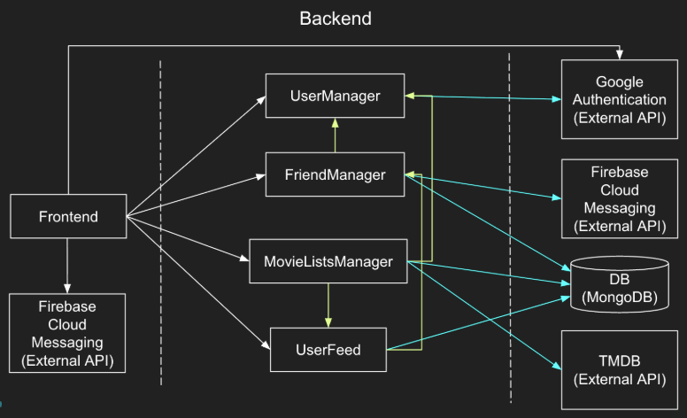

# Requirements and Design

## 1. Change History

| **Change Date** | **Modified Sections** | **Rationale** |
| --------------- | --------------------- | ------------- |
| 2025-10-24      | 3.1 (Ranking UI), Design notes | Redesigned ranking list actions UI: Tap any ranking card to open a Material Design 3 modal bottom sheet with action options. Sheet displays movie title and two actions: "Rerank" (with description "Compare and adjust position") and "Delete from Rankings" (with error color styling). Delete action requires confirmation dialog. Clean, intuitive, and follows Android design patterns. |
| 2025-10-24      | 3.1 (Feed), Bug fix | Fixed duplicate feed entries on rerank: When a user reranks a movie, the system now deletes the original feed activity before creating a new one. This prevents duplicate entries for the same movie appearing in friends' feeds. |
| 2025-10-24      | 3.1 (Discover/Recommendation), 3.4 (Recommendation use case), Navigation order | Added trending movies feature: When users have no ranked movies, the Discover page now displays trending movies from TMDB instead of an empty state. Backend endpoint `/api/recommendations/trending` fetches weekly trending movies. Navigation order changed to: Discover, Ranking, Feed, Friends, Profile (Discover is now the first tab and default landing page after authentication). |
| 2025-10-24      | 3.1 (Profile editing), 3.4 (Edit profile use case), 4.3 (External modules) | Refactored profile picture storage to use MinIO cloud object storage instead of database. Implemented two-step upload flow: (1) Frontend uploads image to POST /api/media/upload and receives public URL, (2) Frontend updates profile via PUT /api/users/profile with profilePicture field set to that URL. MinIO provides S3-compatible object storage with public-read bucket policy. Old images automatically deleted when updating/removing profile pictures. Removed Sharp dependency. |
| 2025-10-23      | 3.1 (Profile editing), 3.4 (Edit profile use case) | Added profile editing feature: users can now edit their display name and upload/change profile pictures. Frontend uses Android photo picker with automatic image resizing. Profile data persists in DataStore for offline access. |
| 2025-10-23      | 3.1 (Recommendation refresh), 3.4 (Recommendation use case) | Added refresh button to Discover page with improved randomization algorithm. Algorithm now randomly selects from top 30% of ranked movies, fetches from multiple TMDB pages (1-5), uses Fisher-Yates shuffle, and takes random windows to ensure variety on each refresh. |
| 2025-10-23      | 3.1 (Watchlist synchronization) | Added automatic watchlist-ranking synchronization: movies are now removed from watchlist when added to rankings, ensuring watchlist only contains unwatched movies. |
| 2025-10-15      | 3.1 (Feed notes + Watchlist), 3.4 (Feed detail + Watchlist), Design notes | Documented Feed enhancements (TMDB description, PST yyyy-MM-dd HH:mm timestamps, card layout), Ranking add via TMDB search, added Watchlist feature (add from feed detail, Profile preview + View All, friend watchlist view), and UI feedback notes. |
| 2025-10-20      | 3.1, 3.4, Design notes | Added "Where to Watch" feature: Feed detail bottom sheet, Watchlist items, and Friend Profile watchlist fetch TMDB watch providers (country from device locale with CA fallback) and either open the TMDB watch link or show available platforms. Feed detail shows an availability line under actions. |
| 2025-10-20      | 3.1, 3.4, Design notes | Refinements: Feed preview now shows availability inline (top 4 platforms, " …" if more). Feed detail "Where to Watch" opens the TMDB watch link. Availability text uses grey tone. Added on-device caching (DataStore, 6h TTL) for provider results to reduce API calls. Default country fallback changed to Canada (CA). |
| 2025-10-14      | 3.1, 3.4 (Manage Friend), Design notes | Implemented and finalized Friends feature: send/accept/reject/cancel requests, remove friend, search by name/email, outgoing requests visible (top) and cancellable, real-time SSE with reconnection/backoff, and in-app feedback messages. |
| 2025-10-22      | 3.1, 3.4, Design notes | Ranking UX: search shows posters and top actors; ranking list shows poster, year, star rating, actors, and overview; year+rating on one line; rank chip above poster. Backend adds movie details and delete‑rank endpoints. |
| 2025-10-22      | 3.1 (Watchlist) | Watchlist improvements: added sorting (date added asc/desc, rating asc/desc) and display of year + star rating on each item. |

---

## 2. Project Description

MovieTier is a social movie companion app that makes discovering, ranking, and sharing films fun and interactive. On this app, users can login and see what movie their friends have currently rated, themselves can rate a new movie, and get a list of recommended movies based on the movies they have recommended.
In this app instead of giving out boring stars to rate a movie, the user decides which movie they liked more in a head-to-head matchup (comparing the new movie to a movie they have previously ranked), and then the app calculates the rank of the movie automatically . Over time, their personal tier list is built automatically, reflecting their true taste in cinema.

--- 

## 3. Requirements Specification

### **3.1. List of Features**

1. Authentication - There will be a google login/auth page that will allow users to sign up or sign into their account. A user can also delete their account.
   - Profile Editing: Users can edit their display name and upload/change profile pictures from the Profile screen. Profile images are uploaded via a two-step process: (1) Upload to MinIO object storage via POST /api/media/upload, (2) Update profile with the returned URL via PUT /api/users/profile. Images are stored in MinIO cloud storage with public-read access. All profile data persists locally in DataStore.
2. Manage Friends - The user can send friend requests (by email or by searching name/email), accept/reject incoming requests, view pending requests, and remove existing friends. Real-time notifications are delivered when a request is received or handled.
3. Feed - A user gets real time updates of their friends activities on their feed. Users get live notification whenever a friend ranks a new movie. Feed contains all friend activities (sorted in reverse chronological order) which include the movie name, ranking, friend name, and movie banner of the friends ranking. 
4. Ranked Movie List - Users will be able to generate a ranked list of movies they have seen. They can search for movies, add movies, and then rank the movie, based on comparison between previously ranked movies.  The app will then assign a final ranking to the movie based on the comparison done by the user.
   - Search results include posters (2:3) and a subtitle with year + up to 3 actors.
   - Ranking list entries show rank chip, poster, year and star rating on one line (e.g., "2023 • ★ 8.4"), top actors, and a short overview.
   - Action sheet: Tap any ranking card to open a modal bottom sheet with action options (Rerank and Delete from Rankings). Delete action requires confirmation.

5. Discover (Recommendation) - Based on users top movies rankings there will be a recommended list of movies that the user can watch. The recommendation list will be generated based on the top movies on the users tiered list. The list will exclude all the movies which are already ranked by the user. Each movie in the list will contain the movie name, movie banner, and movie duration.
   - Trending Movies: When users have no ranked movies, the Discover page displays trending movies from TMDB (weekly trending) instead of an empty state. This provides new users with popular movie suggestions to start their ranking journey.
   - Navigation: Discover is now the first tab in the bottom navigation and the default landing page after authentication, prioritizing movie discovery. Navigation order: Discover → Ranking → Feed → Friends → Profile. 

6. Watchlist - Users can save movies to a personal watchlist (e.g., from the Feed detail). The watchlist is visible on the user's Profile (with a "View All" page) and friends can view each other's watchlists from the friend profile page.
   - Watchlist-Ranking Synchronization: Movies are automatically removed from the watchlist when added to rankings. This ensures the watchlist only contains unwatched movies.
   - Sorting: Date added (Newest/Oldest) and Rating (High→Low / Low→High).
   - Display: Each item shows year and star rating (e.g., "2023 • ★ 8.4") above the description.
   - Where to Watch: Feed preview shows an inline availability line limited to the top 4 platforms (adds " …" if more). Feed detail's "Where to Watch" opens the TMDB watch link. Watchlist and Friend Profile show availability on button press. Country is detected from device locale with CA fallback. Availability text uses the grey on-surface-variant tone.

### **3.2. Use Case Diagram**

### **3.3. Actors Description**

1. User - The User will be the main actor of our app. They will create an account, login, add friends, rank movies and view recommendation lists. 
2. Google Auth API - This will be the external actor which will handle all the sign ins and sign ups. 
3. TMDB API - The TMDB API will provide the movie details and recommendations for movies. This is also an external actor. 

### **3.4. Use Case Description**

- Use cases for feature 1: Authentication

1. Sign In : When a user has already created their account, they can just sign in with their google account.
2. Sign Up: All new users will use the Sign Up use case to create an account.
3. Delete Account: When  a user wants to delete an account.
4. Sign Out: When a user wants to sign out of the app, they can use the sign out use case.
5. Edit Profile: Users can edit their display name and profile picture from the Profile screen. Changes are saved to the backend and persisted locally in DataStore.

- Use cases for feature 2: Manage Friend
 
1. Send Friend Request: Users send friend requests to other users by entering their email or selecting from search results (name/email). Users receive in-app feedback on success/failure.
2. Accept Friend Request: To accept friend requests received by the user.
3. Reject Friend Request : To reject a friend request received by the user. 
4. Remove Friend: To remove a friend who is a friend of the user. 
5. Search Users: Users can search for other users by name or email to send requests.
6. Cancel Outgoing Request: Users can cancel pending outgoing friend requests.

Design notes:
- Real-time events are delivered via HTTP Server-Sent Events (SSE) stream from the backend. Clients connect to `/api/friends/stream` and receive events for `friend_request`, `friend_request_accepted`, `friend_request_rejected`, and `friend_removed`.
- Additional event: `friend_request_canceled` notifies receivers when a pending request is canceled by the sender.
- Basic rate limiting is enforced for sending friend requests to reduce spam (fixed window, max 5/min per user).
- Client behavior: SSE connection uses infinite read timeout with reconnection/backoff to remain stable during idle periods; UI provides immediate in-app feedback (snackbars) for all friend actions.

- Use cases for feature 3: Feed

1. View Feed: The user can view all their friends' activities in their feed. 
2. View Live Update Notification: Every time a friend ranks a movie, a push notification will be received by the user. 
3. Open Movie Detail from Feed: The user taps a feed entry to open a detail sheet with poster/description and can add the movie to their Watchlist or Rankings (with confirmation messages).

- Use cases for feature 4: Ranked Movie List

1. Search a Movie: Users can search names of a movie by using the Search Movie use case.
2. Add a Movie: Users can add a movie to their ranked lists.
3. Compare Movies: To rank a movie users must compare the movie with some other movies they have already ranked for the system to generate an accurate ranking of the movie.
4. View Ranking List: The users can view their ranked movie list.
5. Manage Ranking Entry: Tap a ranking card to open an action sheet for managing entries.
   - Rerank: Start the comparison flow using an adjacent movie as the initial comparator.
   - Delete: Remove the movie (requires confirmation), shifts lower ranks up by one.

- Use cases for feature 5: Discover (Recommendation)

1. View Recommended Movie List: The user can view a list of recommended movies that the application suggests based on their previously ranked movies.
2. View Trending Movies: When users have no ranked movies, the system displays trending movies from TMDB to help them discover popular films and start their ranking journey.
3. Refresh Recommendations: Users can refresh the recommendation list to see different movie suggestions. The system uses randomized algorithms to provide variety on each refresh while still maintaining relevance based on user rankings. 

### **3.5. Formal Use Case Specifications (5 Most Major Use Cases)**

#### Use Case 1: SIGN IN

**Description**: User logs in to their account through Google Authentication API.

**Primary actor(s)**: User, Google Authentication API

**Postcondition(s)**:

User is logged in and redirected to the Discover page
**Main success scenario**: 

1. User clicks “Sign In”
2. System redirects to Google Authentication page
3. User enters credentials and clicks submits
4. Google validates credentials and returns auth token
5. System checks its database for user account
5. System verifies token, signs the user in, and takes them to the Discover page

**Failure scenario(s)**:

- 3a. User enters invalid credentials 
  - 3a1. Google rejects login attempt
  - 3a2. App displays error message and asks the user to retry

- 5a. User account does not exists in database
  - 5a1. System displays error message: “User Does Not Exist Please Sign Up”
  - 5a2. User can use the Sign Up use case

#### Use Case 2: SEND FRIEND REQUEST

**Description**: User sends a friend request to a friend by entering their email address.

**Primary actor(s)**: User

**Precondition(s)**: 

1. User is logged into the system
2. User is on the “Manage Friends” Page

**Main success scenario**:

1. User enters the friends username/email address
2. System searches and displays matching profile
3. User clicks send friend request button 
4. System displays a success message: “Friend Request Successfully Sent”
5. System notifies Friend to accept/deny pending request

**Failure scenario(s)**:

- 1a. No user with the given email/username exists
  - 1a1. System notifies the user: “No user Found”
  - 1a2. User retires this use cases with a different input

- 3a. Friend is already added
  -3a1. System Notifies the user: “Error: Friend already exists”

- 3b. Friend request already pending
  - 3b1. The system notifies the user: “Error: Request was already sent.”

#### Use Case 3: VIEW FEED

**Description**:  User views the recent activities of their friends on their feed. 

**Primary actor(s)**: User

**Precondition(s)**:

User is logged in
The user is on the “Feed” page

**Main success scenario**:

1. System retrieves latest friend activity (new movies ranked by friends)
2. System displays the friend activities in a reverse chronological order 
**Failure scenario(s)**:

- 1a.User has no friends yet
  - 1a1. The system displays “No Friends yet. Add friends to see activity”
  -1a2. The system displays a link to the “Manage Friends” page

- 1b. User’s friends have not ranked any movies
  - 1b1. The system displays “No Friend Activity Yet”

#### Use Case 4: COMPARE MOVIES

**Description**: The system generates movie pairs for the user to compare until the system calculates the ranking of the movie being added. The movie pair consists of the movie being ranked and a movie which the user has already ranked previously. The user selects the movie they prefer from the two movies displayed.  

**Primary actor(s)**: User

**Precondition(s)**: 

1. User is logged in 
2. User has searched for a movie and clicked on “Add Movie”

**Main success scenario**:

1. System selects a movie that the user has previously ranked
2. System asks the user to compare the selected movie and the movie that is being ranked
3. User selects a movie
4. System generates a ranking of the movie
5. Movie gets added to the ranked list of user’s movies
6. User gets notified: “Movie successfully ranked”

**Failure scenario(s)**:

- 1a. User has ranked no movie previously
  - 1a1. Systems adds the movie as it is to the list 

- 3a. User exists the app without comparing
  - 3a1. System exists comparison
  - 3a2. The movie is not added to the list of User’s Movie

- 4a. The systems needs to compare the movie with more previously ranked movies to generate a ranking
  - 4a1. The system keeps on repeating this use case again until a ranking is generated

#### Use Case 5: VIEW RECOMMONDED MOVIE LIST

**Description**: System generates a recommended movie list based on the top movies on the user’s ranked movie list. 

**Primary actor(s)**: User, TMDB API

**Precondition(s)**:

1. User is logged in
2. User clicks the Recommendation tab and is directed to the Recommended movies page

**Main success scenario**:

1. System extracts the top 5-10 movies from the user’s ranked movie list
2. System requests TMDB api to fetch related movies to the selected movies
3. TMDB api sends a list of related movies
4. System filters the list by removing movies which are already in the user’s list
5. System displays the recommended movie list with movie title, and movie banner for each movie

**Failure scenario(s)**:

- 1a. User has no movies ranked
  - 1a1. System displays a message:”No movies in your movie list, to get a personalized list please rank movies”
  - 1a2. System extracts a list of all time favorite movies from TMDB and display those movies

- 4a. User has watched all movies in the recommended list
  -4a1. The system displays a message: “All caught up! You have seen all the movies in your recommended list.”
  -4a2. The system extracts and displays a list of all time favorite movies from TMDB api

### **3.6. Screen Mock-ups**(optional)

### **3.7. Non-Functional Requirements**

1. **[Ranking Performance]**
   - **Description**: Comparative ranking interactions (selecting between two movies) should update the user’s tier list in under 1 second.
   - **Justification**: The comparative ranking feature is the core interaction of MovieTier. If it feels sluggish, the entire app experience suffers. Keeping the update time under 1 second ensures the interaction feels immediate and engaging, which is critical for usability and user retention. We derived this number from this [study](https://www.uptrends.com/blog/the-psychology-of-web-performance).
2. **[Recommendation List]**
   - **Description**: Any core task (signing in, rating a movie, viewing the feed) should be achievable within 3 clicks/taps.
   - **Justification**: The fewer steps users have to make, the smoother and more intuitive their experience feels. According to [Impact of number of clicks on user experience](https://medium.com/@gizemkorpinar/impact-of-click-number-on-user-experience-fab78e1f2a91) (Gizem Korpinar), fewer clicks tend to correlate with higher perceived usability: “the fewer clicks required to achieve a user’s goal, the greater the usability.”  Users often abandon journeys when they perceive they’re clicking too much. While the “3-click rule” isn’t a hard law and some debate its strict applicability, it works well as a guideline for core tasks.
---

## 4. Designs Specification

### **4.1. Main Components**

1. **UserManager**
   - **Purpose**: Handles user sign-up, sign-in (via Google Auth), account creation, and profile management. Ensures each Google account maps to a MovieTier user record in the database.

2. **FriendManager**
   -**Purpose**: Manages friendships (sending/accepting/rejecting friend requests, removing friends) and generates the activity feed with real-time updates when friends rate or compare movies.

3.**MovieListsManager**
   -**Purpose**:  Provides the logic for comparative ranking of movies, stores user rankings, updates tier lists based on comparisons and also computes the user recommendation movie list.

4. **UserFeed**
   -**Purpose**: User feed handles the situation when a user adds a movie to their lists and notifies the users friends on their feed.

### **4.2. Databases**

1. **UserDB**
   - **Purpose**: This is the sole database for our application. We will have separate tables in this database to store user login credentials, ranked movie lists, friends, requests, recommendations, and friend activities. 

### **4.3. External Modules**

1. **Google Auth API**
   - **Purpose**: Authorize sign in and sign ups of users into the application
2. **TMDB API**
   - **Purpose**: Fetch related movies to generate recommended movie lists, respond to the search movies and movie related information
3. **Firebase Cloud Notifications**
   - **Purpose**: Send real time push notifications to the user when a friend ranks a movie.
4. **MinIO Object Storage**
   - **Purpose**: S3-compatible cloud object storage for profile pictures and media files. Provides public-read access to uploaded images with automatic bucket initialization and policy configuration.

### **4.5. Dependencies Diagram**

